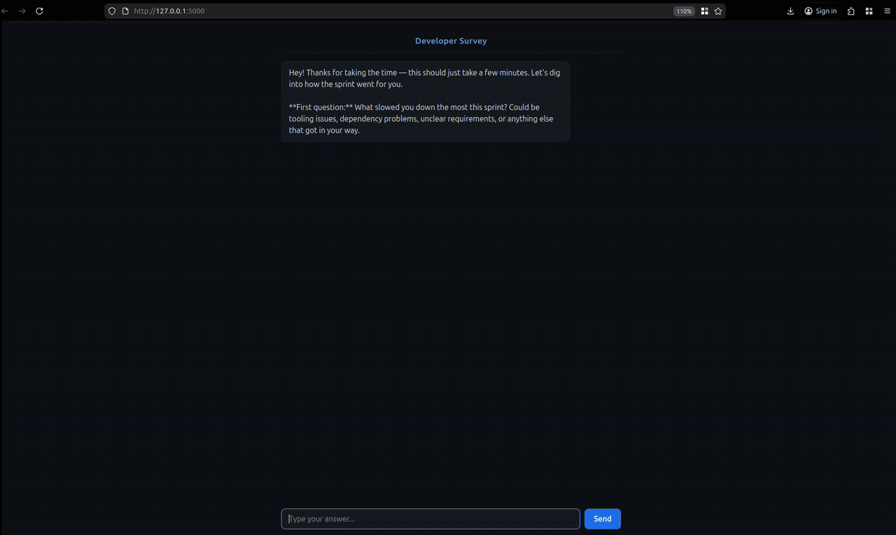

# Harbor — Developer Survey Chatbot

A conversational survey tool that replaces traditional forms with an AI-powered chatbot. Built with Flask and Claude API, it conducts developer surveys through natural conversation and outputs structured JSON results.

# Authors

Vertti Sorvari, Matias Häkkinen and Antto Brandt

## Demo



## Features

- **Conversational surveys** — AI asks natural questions instead of static form fields 
- **Template-driven** — define surveys in JSON, (see /template)
- **Structured output** — completed surveys export as valid JSON (see /result)
- **Lightweight** — Flask backend + vanilla HTML/CSS/JS frontend

## Setup

```bash
# Clone and enter the project
git clone https://github.com/hakkinM/survey-bot.git

# Create and activate a virtual environment
python -m venv venv
source venv/bin/activate

# Install dependencies
pip install -r requirements.txt
```
1. Get a API Key for Claude from Anthropic.
2. Create a `.env` file with your Anthropic API key:

```
ANTHROPIC_API_KEY=your-api-key-here
```

## Usage

```bash
python server.py 
# or
python3 server.py
```

Open `http://localhost:5000` in your browser. The chatbot will greet you and begin asking survey questions based on the active template.

## Survey Templates

Templates are JSON files in the `template/` directory. Each defines a set of question areas:

```json
{
  "survey_id": "my-survey",
  "title": "My Survey",
  "max_questions": 10,
  "question_areas": [
    {
      "area_id": "blockers",
      "topic": "Blockers",
      "intent": "What slowed you down this sprint?",
      "response_type": "open_text",
      "required": true
    },
    ...
  ]
}
```

Supported response types: `open_text`, `rating_1_to_5`.

## Output

Completed surveys are saved as structured JSON. See [result/result.json](result/result.json) for an output of the demo:

```json
{
  "survey_id": "dev-experience-survey",
  "respondent_id": "abc123",
  "completed_at": "2025-01-01T12:00:00Z",
  "responses": [
    {
      "area_id": "blockers",
      "question_asked": "What slowed you down this sprint?",
      "answer": "Waiting on API documentation from the backend team.",
      "response_type": "open_text"
    },
    ...
  ]
}
```

## Tech Stack

- **Backend:** Python, Flask, Anthropic SDK (Claude Haiku 4.5)
- **Frontend:** HTML, CSS, JavaScript (no framework)
